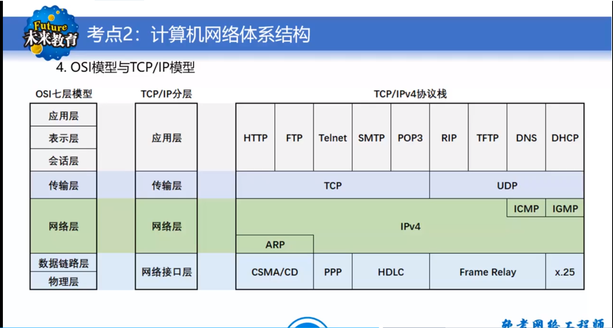
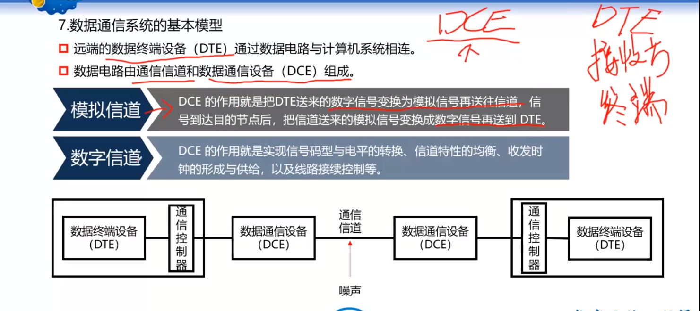
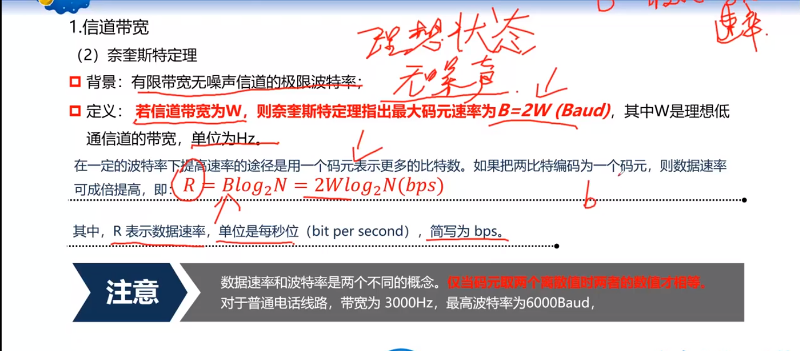
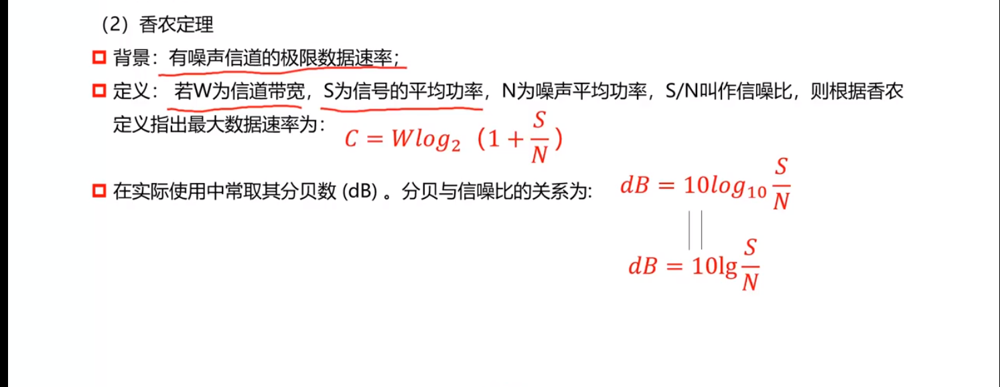
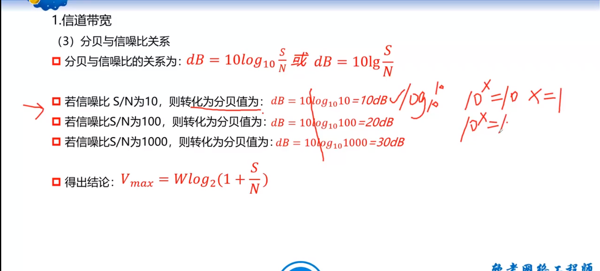

# 计算机网络概论
## 计算机网络概述
### ARPAnet
- 现代意义上的网络是在1969年美国国防部最高研究计划局(DARPA)建成的ARPAnet实验网开始的
- 特点  
  - 资源共享
  - 分散控制
  - 分组交换
  - 采用专门的通信控制处理机
  - 分层的网络协议
### 计算机网络分类
- 概念
  - 通过[通信线路]的[通信设备链]接的许多分散独立工作的计算机系统，遵循一定的[协议]用软件实现资源共享
- 网络节点
  - 转发节点
    - 网络通信过程中控制和转发信息的节点，例如交换机，集线器，接口信息处理机
  - 端节点
    - 信源和新宿节点； 
- 通信线路
  - 传输信息的通道，可以时电话线，同轴电缆，无线卫星
- 资源子网
  - 包括拥有资源的用户主机，和请求用户资源的用户终端
- 通信子网
  - 在端节点之间传送由信息组成的报文，主要有转发节点和通信线路组成
  - IMP中专用于通信的计算机，当IMP接到一个报文后要根据报文的目标地址决定把该报文提交给他相连的主机还是转发到下一个IMP
- 拓扑结构
  - 通信子网中转发节点的互联模式叫做子网的拓扑结构，在广域网中常见的互联拓扑是树形结构和不规则形。
  - 星形网络
  - 总线型网络
  - 环形网络
  - 树形网络
  - 全网状型网络
  - 部分网状网络
  - 组合型网络拓扑
- 局域网
- 城域网
- 广域网
- 校园网
- 企业网
- 内联网
- 外联网
- 公网 ISP 中国联通 中国电信 中国移动通信
- 专网
- 通信网
- 信息网 ICP
### 计算机网络的应用
- 办公自动化
- 电子数据交换
- 远程教育
- 电子银行
- 证券和期货交易
- 娱乐和在线游戏
## 计算机网络
- OSI参考模型
  - 国际化标准组织ISO提出了一个视图使各种计算机在世界范围之内互联成网的标准框架，即注明的开放系统互联基本参考模型ISO/OSI参考模型，简称OSI
  - 分层的体系结构，分层的基本思想就是每一层都在他的下层提供的服务基础之上，提供跟高级别的增值服务，而最高层提供因能运行分布式应用程序的服务
  - 保持层次之间的独立性，
  - 除最高层之外，在互联的各个开放系统中分布的所有实协同工作，为所有实体提供服务
- SAP service Accessing point  服务访问点，上层访问下层所提供的服务点
- OSI/RM主要功能
  - 物理层：二进制传输，单位为位，
  - 数据链路层：接入位置，单位为帧
  - 网络层：数据报文，数据分组，定位ip地址，负责数据在原地址到目标地址之间的传输，
  - 传输层：端到端的传输 TCP和UDP的数据传输
  - 会话层：建立会话，数据要建立会话，链接主机通信。互联，
  - 表示层：数据表示
  - 展示层：进行数据展示
- OSI模型和TCP/IP模型
- 
- TCP协议
  - 提供面向连接的、全双工的、可靠的传输服务
  - 提供数据保错误检测、回应确认、流量控制和数据包顺序控制机制
  - 面向连接的服务，需要建/拆连接
  - 全双工字符流通信
  - 支持报文分组
  - 提供包的差错控制，书顺控制、应答与重传机制
  - 提供流量控制
  - 保证发送方不会淹没接收方
  - 提供报文阻塞机制
  - 保证发送发不会"淹没"在网络中的路由器
- UDP协议
  - 无连接不可靠的传输服务，基本的低延迟的数据通信
  - 没有确认机制来保证数据是否被正确接收
  - 不需要重传遗失的数据
  - 数据的接收可不必按照顺序进行
  - 没有控制数据流速度的机制
  - 适合讯息量大、时效性大雨可靠性的传输
- 端口号
  - 范围0-65535
  - TCP/IP：1-216
  - RDP：3389
  - 服务器使用到的内部端口：熟知端口号：0-1023 系统端口号：1024-49151
  - 客户端端口号：49152-65535
  - web端口:443 80
  - SMTP:25
  - pop3:110
  - https:443
  - 区分不同的网络服务的
## 数据通信基础
### 基本概念
- 数据通信模型
  - 通信中产生和发送信息的端叫做信源 ：DCE
    - 模拟数据取连续值
    - 而数字数据取离散值
  - 接收信息的端叫做信宿 ： DTE
    - 接收信息的目的地
  - 信源和信宿之间的通信线路称之为信道
    - 有线信道
      - 明线
      - 暗线
    - 无线信道
      - 自由空间
  - 信息在传输的过程中可能会受到外界的干扰，把这种干扰称之为噪声
- 信源产生信息分类
  - 模拟数据
    - 模拟信号
    - 在时间和幅度取值上是连续的，其电平也随时间变化。
  - 数字数据
    - 表示数字信号称作数字信号
    - 在时间上是离散的，在幅值上是经过量化的，一般由0和1组成，计算机中传送的是典型的数字信号
- 信道与电路
  - 信息传输的必经之路"信道",信道由物理和逻辑之分
  - 物理通道
    - 用来传送信号或者数据的物理线路，网络中两个节点之间的物理通路就是通信线路，物理通道是由传输介质极其有关设备组成的
  - 逻辑通道
    - 在物理通道之上，在节点内部和节点之间建立的连接来实现的，通常成为连接
  - 信道和店里不同，信道一般用来表示某一个方向传送数据的媒体，一个信道可以看成是电路的逻辑部件
  - 一条电路至少包括一条发送信道和一条接收信道
- 调制和解调
  - 为了利用现有的线路传输信号，就必须吧数字信号转换成模拟信号，这个过程叫做调制
  - 接受到的模拟信号转换成数字信号，这个过程就是解调
  - 由于数据的传输是双向的，因此需要调制和解调，设备叫做调制调节器modem，
- 基带和宽带
  - 基带就是蒋数字信号1或者0直接用不同的电压来表示，然后送到新路上传输
  - 宽带信号就是将基带信号进行调制后形成的频分复用信号
  - 数据通信是两个实体之间的数据传输和交换
  - 数据传输就是传播和处理信号的shujutongxin，将源站的数据编码和信号，沿着传输介质传播至目的站
  - 信道：传送信息的线路
  - 比特率：数据传输速率
  - 码元：时间轴上的一个信号编码单位
- 数据通信的基本模型
  - 远端的数据终端设备(DTE) 通过数据电路与计算机系统相连，
  - 数据电路是由通信信道和数据通信设备(DCE)组成
  - 
- 信道带宽
  - 信道带宽 w = f2 - f1，其中f1是信道通过的最低频率，发2是信道通过的最高的频率，两者都是由信道的物理特性决定的
  - 在计算机网络中，宽带用来表示网络中某信道传送数据的能力
  - 码元相关的知识
    - 一个数字脉冲（二进制数码），称为一个码元，用码元速率表示时间单位内信号波形的变换次数，即单位时间内通过信道传输的码元的个数，单位是波特
    - 数字信号码元宽度为T秒，则码元速率  B = 1/T
    - 码元单位为波特，码元速率叫做 波特率
    - 单位时间之内信号波动的次数，
    - 码元携带的信息量由码元取的离散值个数决定的
    - 若码元取两个离散值，则码元信息量为1比特，若码元取4个离散值，则码元信息量为2比特
    - 一个码元携带数量n于=与码元的种类数N有入选关系 n = log2n n = 2^n
  - 奈奎斯特定理
    - 有限带宽无噪声信道的极限波特率
    - 信道带宽定位w，则奈奎斯特定律指出最大码元速率B = 2W，其中w是理想低信道的带宽，单位为Hz
    - 
  - 香农定理
    - 衰减
      - 信道在传输过程中，信号收到距离关系，信道衰减越大，信噪比越小
    - 延迟
      - 信号中各种频率在信道上的延迟时间个不行同，在接收端会产生变形
    - 噪声
      - 热噪声：体内的热扰动引起，又称为白噪声
      - 串扰：信道之间产生不必要的耦合
      - 脉冲噪声，非连续，随机，振幅较大
    - 有噪声信道的极限数据速率
    - 若w为信道带宽，s为信号的平均功率，n为信道噪声功率，则数据速率 C = wlog2(1+s/n)
      - 
  - 分贝与信噪声比关系
    - 
    - 在一条为300Hz，信噪比为30db的信道中，不管传输的信号等级是多少，也不管采样评率是多少，信道上最大传输速率不超过30Kbps，其计算过程如下
    - 按照奈奎斯特定理，B = 2W(B码元速率，波特率)
    - 信息量n与码元种类N：n = log2n，
    - 

